# A&R Admin Boot Camp

  

    
INTERNAL TRAINING PORTAL

    <h1 class="hero-title">A&R Admin Boot Camp</h1>
    
A searchable training platform for understanding the financial, contractual, operational, credit, clearance, delivery, and release workflows behind artist projects.

    

      <a href="foundations/what-is-ar-admin/" class="button-primary">Start Foundations</a>
      <a href="foundations/project-lifecycle/" class="button-secondary">View Project Lifecycle</a>
      <a href="reference/glossary/" class="button-tertiary">Open Glossary</a>
    

  

---

## Quick Reference

  

    
📋

    
Deals

    
Deal memos, producer agreements, side-artist agreements, label waivers, and talent releases. Everything you need to manage artist contracts and legal paperwork.

  

  
  

    
💰

    
Budgets

    
Project budgets, advances, purchase orders, payment tracking, and recording fund allocation. Master the financial side of A&R administration.

  

  
  

    
🔍

    
Clearances

    
Sample clearances, side-artist clearances, and union requirements. Ensure every element of your release is properly cleared.

  

  
  

    
🎵

    
Releases

    
Release readiness, production delivery, vinyl specifications, and Spotify pitch tools. Navigate the complete release pipeline.

  

---

## Learning Paths

Choose your starting point based on your experience level:

  

    
🟢 Beginner

    <ul class="learning-card-items">
      <li>What A&R Admin Does</li>
      <li>Team Structure</li>
      <li>Artist/Project Lifecycle</li>
      <li>Basic Systems Overview</li>
    </ul>
  

  
  

    
🟡 Intermediate

    <ul class="learning-card-items">
      <li>Budgets & Financial Planning</li>
      <li>Uniport Setup & Management</li>
      <li>Atlas Configuration</li>
      <li>Purchase Orders</li>
      <li>Producer Agreements</li>
      <li>Credits & Label Copy</li>
    </ul>
  

  
  

    
🔴 Advanced

    <ul class="learning-card-items">
      <li>Sample Clearances</li>
      <li>Side-Artist Clearances</li>
      <li>Mastering & Delivery</li>
      <li>Atmos Specifications</li>
      <li>Metadata Management</li>
      <li>Release Readiness</li>
      <li>Publishing Concepts</li>
    </ul>
  

---

## Knowledge Base

  <a href="foundations/what-is-ar-admin/" class="dashboard-card">
    
📚 Foundations

    
Core concepts, team structure, department overview, and project lifecycle. Everything a new A&R admin needs to know to get started.

    
Beginner

  </a>
  
  <a href="systems/atlas/" class="dashboard-card">
    
🖥️ Systems

    
Atlas, Uniport, and vendor setup. Learn the internal tools and platforms that power A&R administration.

    
Beginner

  </a>
  
  <a href="finance/budgets/" class="dashboard-card">
    
💵 Finance

    
Budgets, advances, purchase orders, payments, and recording funds. Master the financial workflows of A&R projects.

    
Intermediate

  </a>
  
  <a href="contracts/deal-memos/" class="dashboard-card">
    
📄 Contracts

    
Deal memos, producer agreements, side-artist agreements, label waivers, and talent releases.

    
Intermediate

  </a>
  
  <a href="recording/recording-process/" class="dashboard-card">
    
🎙️ Recording

    
Recording process, producer coordination, mixing, mastering, Atmos, and production deliverables.

    
Intermediate

  </a>
  
  <a href="clearances/samples/" class="dashboard-card">
    
✅ Clearances

    
Sample clearances, side-artist clearances, and union requirements. Ensure everything is properly cleared.

    
Advanced

  </a>
  
  <a href="credits/metadata/" class="dashboard-card">
    
🏷️ Credits

    
Metadata management, label copy, and publishing information. Get the details right before release.

    
Advanced

  </a>
  
  <a href="releases/release-readiness/" class="dashboard-card">
    
🚀 Releases

    
Release readiness, production delivery, vinyl specifications, and Spotify pitch tools.

    
Advanced

  </a>
  
  <a href="publishing/publishing-101/" class="dashboard-card">
    
📊 Publishing

    
Publishing concepts, royalties, mechanical licensing, performance rights, and synchronization.

    
Advanced

  </a>
  
  <a href="reference/glossary/" class="dashboard-card">
    
📖 Reference

    
Glossary, acronyms, FAQ, and checklists. Quick lookups for terminology and common processes.

    
Reference

  </a>

---

## Project Journey

The typical workflow for an A&R-administered project:

```mermaid
graph LR
    A["Artist Signed"] --> B["Atlas Setup"]
    B --> C["Uniport Setup"]
    C --> D["Deal Memo"]
    D --> E["Budget Approval"]
    E --> F["Recording"]
    F --> G["Producer/Mixer<br/>Paperwork"]
    G --> H["Samples/Side<br/>Clearances"]
    H --> I["Credits &<br/>Label Copy"]
    I --> J["Mastering"]
    J --> K["Atmos"]
    K --> L["Production<br/>Delivery"]
    L --> M["Release"]
    M --> N["Backend<br/>Payments/Wrap"]
    
    style A fill:#d4af37,color:#0a0a0a,font-weight:bold
    style N fill:#d4af37,color:#0a0a0a,font-weight:bold
    style B fill:#2a2a2a,color:#ffffff,stroke:#d4af37,stroke-width:2px
    style C fill:#2a2a2a,color:#ffffff,stroke:#d4af37,stroke-width:2px
    style D fill:#2a2a2a,color:#ffffff,stroke:#d4af37,stroke-width:2px
    style E fill:#2a2a2a,color:#ffffff,stroke:#d4af37,stroke-width:2px
    style F fill:#2a2a2a,color:#ffffff,stroke:#d4af37,stroke-width:2px
    style G fill:#2a2a2a,color:#ffffff,stroke:#d4af37,stroke-width:2px
    style H fill:#2a2a2a,color:#ffffff,stroke:#d4af37,stroke-width:2px
    style I fill:#2a2a2a,color:#ffffff,stroke:#d4af37,stroke-width:2px
    style J fill:#2a2a2a,color:#ffffff,stroke:#d4af37,stroke-width:2px
    style K fill:#2a2a2a,color:#ffffff,stroke:#d4af37,stroke-width:2px
    style L fill:#2a2a2a,color:#ffffff,stroke:#d4af37,stroke-width:2px
    style M fill:#2a2a2a,color:#ffffff,stroke:#d4af37,stroke-width:2px
```

---

## Popular Searches

Quick access to the most-referenced topics:

  <a href="systems/atlas/" class="search-chip">Atlas</a>
  <a href="systems/uniport/" class="search-chip">Uniport</a>
  <a href="contracts/deal-memos/" class="search-chip">Deal Memo</a>
  <a href="finance/budgets/" class="search-chip">Budget</a>
  <a href="finance/purchase-orders/" class="search-chip">Purchase Order</a>
  <a href="recording/producers/" class="search-chip">Producer Backend</a>
  <a href="clearances/samples/" class="search-chip">Sample Clearance</a>
  <a href="clearances/side-artists/" class="search-chip">Side Artist</a>
  <a href="credits/label-copy/" class="search-chip">Label Copy</a>
  <a href="recording/mastering/" class="search-chip">Mastering</a>
  <a href="recording/atmos/" class="search-chip">Atmos</a>
  <a href="releases/spotify-pitch-tool/" class="search-chip">Spotify Pitch</a>
  <a href="publishing/publishing-101/" class="search-chip">Publishing</a>
  <a href="publishing/mechanicals/" class="search-chip">Mechanical Royalties</a>
  <a href="publishing/synchronization/" class="search-chip">Sync</a>

---

## New Intern Orientation

  
Your First Week

  <ul class="orientation-panel-content">
    <li><strong>Start with Foundations</strong> — Understand what A&R administration is, who's on the team, and the basic project lifecycle before diving into processes.</li>
    <li><strong>Learn the Systems Next</strong> — Get familiar with Atlas, Uniport, and how vendors are managed. These are the tools you'll use every day.</li>
    <li><strong>Use Checklists Before Asking</strong> — Before asking about a process, check the Reference section. Most common workflows have checklists to keep you organized.</li>
    <li><strong>Use Glossary for Unfamiliar Terms</strong> — When you encounter terminology you don't recognize (deal memo, Atmos, mechanical, sync, etc.), look it up in the Glossary. Building your vocabulary is essential.</li>
    <li><strong>Treat This as a Working Manual</strong> — This isn't a static document. Use it daily. Bookmark common pages, return frequently, and ask questions when the documentation doesn't cover your specific situation.</li>
  </ul>

---

## Need Help?

- **Can't find something?** Use the search box at the top of the page—it searches all documentation.
- **Looking for a specific workflow?** Check the Knowledge Base cards above or browse the full navigation on the left.
- **New term or acronym?** Head to [Reference → Glossary](reference/glossary/) or [Reference → Acronyms](reference/acronyms/).
- **Common question?** Check [Reference → FAQ](reference/faq/) for quick answers.
